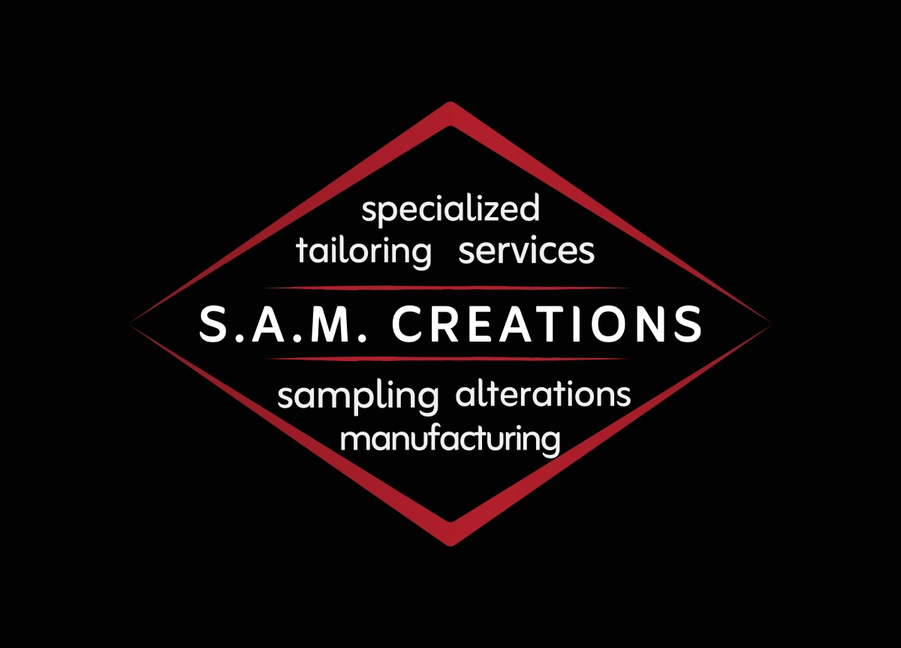

# S.A.M. Creations



This repository powers the S.A.M. Creations website, a Next.js marketing site for a London garment manufacturing studio. It presents the business online in a way that feels polished and editorial, while still giving visitors clear paths to learn about the studio, explore its work, and get in touch.

The site is built around a small set of focused journeys: explaining who S.A.M. Creations is, showing how the studio works, highlighting achievements and case studies, displaying gallery imagery, and collecting project enquiries through the contact form. It is a content-led site first, with the codebase structured to make that content manageable.

## What The Site Includes

- `/` introduces the studio, its services, featured achievements, and key client signals.
- `/about` explains the business background, values, leadership, and team positioning.
- `/process` walks through sampling, production setup, quality control, and delivery.
- `/work` showcases achievements and case studies pulled from MDX content.
- `/gallery` displays portfolio imagery from the gallery content source.
- `/contact` provides studio details, social links, and a project enquiry form.

## Architecture At A Glance

This project uses the Next.js App Router, so the main pages live in `src/app`. Shared layout pieces, transitions, and reusable UI live in `src/components`, keeping page files mostly focused on content and composition.

Structured long-form content is handled with MDX. Case studies are stored under `src/app/work` as `page.mdx` files with exported metadata, and the app loads them through `src/lib/mdx.js`. The gallery follows the same idea, with its current image set defined in `src/app/gallery/photos/page.mdx`.

The contact page uses a server action in `src/app/contact/action.js` to send enquiries through Resend. That action validates required fields, applies a basic in-memory rate limit, and forwards the submitted details to the configured contact email address.

## Tech Stack

- Next.js 14 with the App Router
- React 18
- Tailwind CSS v4
- MDX for case study and gallery content
- Framer Motion for transitions and motion
- Resend for contact form delivery
- `next/image` for image handling

## Getting Started

Install dependencies and start the local development server:

```bash
npm install
npm run dev
```

Other useful project commands:

```bash
npm run build
npm run start
npm run lint
```

`npm run build` creates the production build, `npm run start` serves that build, and `npm run lint` runs the project's Next.js lint setup.

## Environment Variables

The contact form depends on two environment variables:

| Variable | Purpose |
| --- | --- |
| `RESEND_API_KEY` | Authenticates requests to Resend when sending contact form emails. |
| `CONTACT_EMAIL` | Receives project enquiry submissions from the contact form. |

## Deployment Notes

This app deploys as a standard Next.js server build. A PM2 config is included in `ecosystem.config.js` for process management in production.

## Maintaining Content

Most copy updates happen directly in the route files under `src/app`, especially the main pages like `page.jsx`, `about/page.jsx`, `process/page.jsx`, and `contact/page.jsx`. Shared wording or repeated presentation patterns are usually handled through reusable components in `src/components`.

To add or update achievements, edit the MDX entries in `src/app/work`. Each case study combines frontmatter-like exported metadata with the body content used on the detail page and in the listing view.

To update the gallery, edit `src/app/gallery/photos/page.mdx`. That file defines the gallery metadata and imports the image set used to build the gallery page.
